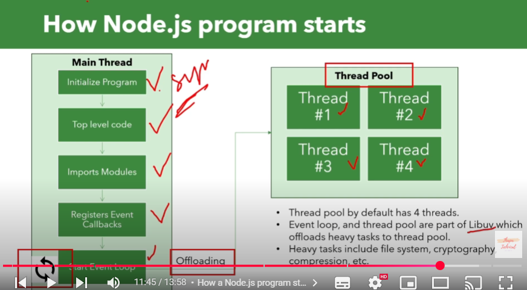
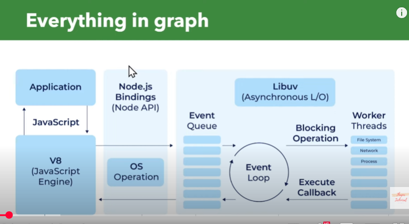

## Event Module
The `events` module in Node.js provides the `EventEmitter` class, which is central to Node's asynchronous event-driven architecture. Objects can emit named events that cause registered listeners to be called.

```javascript
const EventEmitter = require('events');

// Create an emitter instance
const myEmitter = new MyEmitter();

// Register a listener
myEmitter.on('event', () => {
    console.log('an event occurred!');
});

// Emit the event
myEmitter.emit('event');
```

### Creating HTTPS Servers
Node.js can create HTTPS servers using the `https` module. This requires an SSL certificate (key and certificate files).

```javascript
const https = require('https');
const fs = require('fs');

const options = {
    key: fs.readFileSync('path/to/your/private.key'), // Replace with your key file path
    cert: fs.readFileSync('path/to/your/certificate.crt') // Replace with your cert file path
};

https.createServer(options, (req, res) => {
    res.writeHead(200);
    res.end('Secure Hello World!\n');
}).listen(443); // Default HTTPS port

console.log('HTTPS server running on port 443');
```
This snippet shows how to create a basic HTTPS server using provided SSL credentials.

### Nodemon
Nodemon is a utility that monitors for any changes in your source code and automatically restarts your Node.js application. It's particularly useful during development.

**Installation:**
```bash
npm install -g nodemon
```
or as a development dependency: 
```bash
npm install --save-dev nodemon
```

**Usage:**
Instead of `node your_app.js`, run:
```bash
nodemon your_app.js
```

### Creating Your Own Package
You can create your own reusable Node.js package and potentially publish it to npm.

**Steps:**
1.  **Create a directory** for your package.
2.  **Navigate** into the directory in your terminal.
3.  **Initialize** the package using `npm init`. Follow the prompts to create a `package.json` file.
    ```bash
    npm init -y # (use -y for default settings)
    ```
4.  **Write your module code**. Typically, the main entry point is `index.js` (or whatever you specified during `npm init`). Export the functionality you want to make available.
    ```javascript
    // index.js (example)
    function greet(name) {
        return `Hello, ${name}!`;
    }
    module.exports = { greet };
    ```
5.  **(Optional) Publish to npm**: If you want to share your package, you can publish it using `npm publish` after logging in with `npm login`. Ensure your package name is unique.

## Node Versioning Explained
Node.js and npm packages follow Semantic Versioning (SemVer).

**Format:** `MAJOR.MINOR.PATCH`

*   **MAJOR**: Incremented for incompatible API changes.
*   **MINOR**: Incremented for adding functionality in a backward-compatible manner.
*   **PATCH**: Incremented for backward-compatible bug fixes.

**Symbols in `package.json`:**

*   `^` (Caret): Allows updates to the latest MINOR or PATCH version without changing the MAJOR version.
    *   Example: `^1.2.3` allows versions `>= 1.2.3` and `< 2.0.0`.
*   `~` (Tilde): Allows updates to the latest PATCH version without changing the MAJOR or MINOR version.
    *   Example: `~1.2.3` allows versions `>= 1.2.3` and `< 1.3.0`.
*   No symbol (Exact): Requires the exact specified version.
    *   Example: `1.2.3` only allows version `1.2.3`.
*   `*` or `x`: Allows any version (use with caution).

This system helps manage dependencies and ensures compatibility while allowing for updates and bug fixes.

## V8 Engine & Libuv

### V8 Engine
- Google's open-source JavaScript engine written in C++
- Compiles JavaScript directly to native machine code before execution
- Key features:
    - Just-In-Time (JIT) compilation
    - Efficient garbage collection
    - Hidden class optimization
    - Inlining
    - Fast property access
- Powers Node.js and Chrome browser
- Interview points:
    - How V8 handles memory (heap space limits)
    - Event loop implementation
    - How V8 optimizes JavaScript execution

### Libuv
- Cross-platform support library focusing on asynchronous I/O
- Core components:
    - Event loop
    - Thread pool
    - File system operations
    - Network I/O
    - Inter-process communication
- Powers Node.js non-blocking architecture
- Interview points:
    - Event loop phases
    - How async operations are handled
    - Thread pool usage scenarios
    - How callbacks are managed
    - Relationship with Node.js architecture




