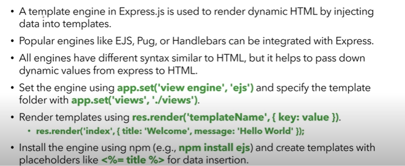

### Process:  
The `process` object is a global variable in Node.js that provides information about, and control over, the current Node.js process. It allows access to environment variables, command-line arguments, and provides methods to interact with the process itself. In Express applications, it's commonly used to access environment variables like `process.env.PORT`.

### Environment Variables
Environment variables are key-value pairs that can configure application behavior outside your code.

**In Windows:**
1. Set variables temporarily in Command Prompt:
    ```
    set NODE_ENV=development
    ```

2. Set variables permanently:
    - Right-click Computer > Properties > Advanced system settings > Environment Variables
    - Or use PowerShell: `[Environment]::SetEnvironmentVariable("NODE_ENV", "development", "User")`

3. Access in Express(OLD VERSIONS):
    ```javascript
    // Use dotenv to load .env file variables
    require('dotenv').config();
    
    // Access variables
    const port = process.env.PORT || 3000;
    ```

Using `.env` files with the `dotenv` package is recommended for managing environment variables across platforms.  

## Methods to serve the static files in Express:
 
1. **Using `express.static` middleware**: This is the most common way to serve static files in Express. It allows you to specify a directory from which to serve static files like images, CSS, and JavaScript.

   ```javascript
   const express = require('express');
   const app = express();
   const path = require('path');

   // Serve static files from the 'public' directory
   app.use(express.static(path.join(__dirname, 'public')));

   app.listen(3000, () => {
       console.log('Server is running on port 3000');
   });
   ```
   In this example, any files in the `public` directory will be served at the root URL. For example, if you have a file `public/image.png`, it can be accessed at `http://localhost:3000/image.png`.
   > Make sure you always pass the absolute path and the public  folder should be in the same directory as the server file.
   > The `path.join(__dirname, 'public')` ensures that the path is constructed correctly regardless of the operating system.

   ## ES Module Caveat:
   1.)  Use `import` instead of `require`  

   2.) In newer version you can use the top level without wrapping it in a async function.  

**ES Module Version with Top-Level Await:**


```javascript
import express from 'express';
import path from 'path';
import { fileURLToPath } from 'url';

const __dirname = path.dirname(fileURLToPath(import.meta.url));
const app = express();

app.use(express.static(path.join(__dirname, 'public')));

// Using top-level await (available in ECMAScript modules)
const server = await app.listen(3000);
console.log('Server is running on port 3000');

```

### Top-Level Await in JavaScript

Top-level await enables developers to use the `await` keyword outside of async functions in ECMAScript modules.

**Key features:**
- Available only in ES modules (files with `.mjs` extension or with `"type": "module"` in package.json)
- Allows asynchronous operations at the module level without wrapping in async functions
- Module execution is paused until the awaited promises resolve
- Modules that import a module using top-level await will wait for it to complete

**Example:**
```javascript
// Data fetching at module level
const response = await fetch('https://api.example.com/data');
const data = await response.json();
export { data };
```

ECMAScript handles top-level await by treating modules with top-level await as asynchronous modules in the dependency graph, ensuring proper execution order and dependency resolution.
   
3.)  We have `import.meta.` moethods to get the current directory and file name.
---
## Route Parameters in Express  
Route parameters are named URL segments that act as placeholders for values in the URL. They are defined in the route path using a colon (`:`) followed by the parameter name. When a request matches a route with parameters, the values are extracted and made available in the `req.params` object.
Route parameters are useful for creating dynamic routes that can handle different values in the URL.
## Query Parameters in Express
Query parameters are key-value pairs appended to the URL after a question mark (`?`). They are used to pass additional information to the server. In Express, query parameters can be accessed using `req.query`, which returns an object containing the parsed query string parameters. 

> for multiple query parameters, use `&` to separate them. For example: `http://localhost:3000/search?query=express&sort=asc`

## Form Submission in Express  
- You can use the `<form>` tag with the action attribute to specify the URL  
- By deffault, a ffform will use the `GET` method to submit data, you can handle it with `app.get` to access the form data via `req.query`, as the data is sent through the URL as `query strings`.  
- Since URLs have length limitations, it's better to use the `POST` method for larger data submissions.  
- To handle form submissions with the `POST` method, you need to set up a route using `app.post` and use middleware like `body-parser` or Express's built-in `express.urlencoded()` to parse the form data.
- The form data will be available in `req.body` after parsing.

### Form Submission Example in Express

Here's a complete example of handling form submission in Express:

```javascript
import express from 'express';
import path from 'path';
import { fileURLToPath } from 'url';

const __dirname = path.dirname(fileURLToPath(import.meta.url));
const app = express();
const port = 3000;

// Middleware to parse form data
app.use(express.urlencoded({ extended: true }));
// Serve static files
app.use(express.static(path.join(__dirname, 'public')));

// Route to serve the HTML form
app.get('/form', (req, res) => {
    res.send(`
        <h1>User Registration</h1>
        <form action="/submit" method="POST">
            <div>
                <label for="name">Name:</label>
                <input type="text" id="name" name="name" required>
            </div>
            <div>
                <label for="email">Email:</label>
                <input type="email" id="email" name="email" required>
            </div>
            <button type="submit">Submit</button>
        </form>
    `);
});

// Route to handle form submission
app.post('/submit', (req, res) => {
    const { name, email } = req.body;
    
    // In a real app, you'd validate and save the data
    console.log('Form data received:', req.body);
    
    res.send(`
        <h1>Registration Successful!</h1>
        <p>Name: ${name}</p>
        <p>Email: ${email}</p>
        <a href="/form">Back to form</a>
    `);
});

app.listen(port, () => {
    console.log(`Server running at http://localhost:${port}`);
});
```

This example demonstrates:
1. Setting up middleware to parse form data
2. Creating a route to serve an HTML form
3. Handling the POST request when the form is submitted
4. Accessing form data through `req.body`
5. Sending a response back to the user
  
> WHy USE `express.urlencoded()`?
- The `express.urlencoded()` middleware is used to parse incoming requests with URL-encoded payloads, which is the default format for form submissions in HTML. It converts the data into a JavaScript object and populates `req.body` with the parsed data. This allows you to easily access form data in your route handlers without needing to manually parse the request body.  

## Handling the 404 Error in Express
- You can use the `app.use()` method to define a middleware function that will handle 404 errors. This middleware should be placed after all your route definitions to catch any requests that do not match any defined routes.  
``` javascript
    app.use((req, res, next) => {
        res.status(404).send('404 Not Found');
    });
```

## Express Routers and Modularization
 - A router in Express.js is a tool to defone a modular and resuable routes in an application  
 - It is created using the `express.Router()` method and can be used to define routes, middleware, and other functionality.
 -routes can be defined using methods like `router.get()`,` router.post()`, etc.
 - The router is mounted in the main app using `app.use('/basepath', router)`.
 - This allows you to organize your routes into separate files or modules, making your code more maintainable and easier to read.

---
## Template Engine in EJS
 
## EJS (Embedded JavaScript Templates)

EJS is a simple templating engine that lets you generate HTML with plain JavaScript. It supports variables, conditions, loops, includes, and more.

### Setting up EJS in Express

```javascript
// Install: npm install ejs
import express from 'express';
const app = express();

// Set EJS as the view engine
app.set('view engine', 'ejs');
app.set('views', './views'); // Directory for template files
```

### Key Features and Syntax

1. **Variables**:
    ```ejs
    <h1><%= title %></h1>
    ```

2. **Unescaped HTML** (use cautiously):
    ```ejs
    <%- rawHtml %>
    ```
3. ** Escape HTML**:
    ```ejs
    <%= userInput %>
    ```
    This will escape any HTML tags in the `userInput` variable.

3. **JavaScript code execution**:
    ```ejs
    <% if (user.loggedIn) { %>
      <p>Welcome, <%= user.name %>!</p>
    <% } else { %>
      <p>Please log in</p>
    <% } %>
    ```

4. **Loops**:
    ```ejs
    <ul>
      <% items.forEach(item => { %>
         <li><%= item.name %></li>
      <% }); %>
    </ul>
    ```

5. **Including other templates**:
    ```ejs
    <%- include('partials/header') %>
    ```

### Example Usage in Express

```javascript
app.get('/', (req, res) => {
  res.render('index', {
     title: 'Home Page',
     user: { name: 'John', loggedIn: true },
     items: [{ name: 'Item 1' }, { name: 'Item 2' }]
  });
});
```

### Benefits
- Familiar JavaScript syntax
- Simple to learn and use
- Can be used for client and server-side rendering
- Easy to integrate with Express.js

## EJS Partials

Partials are reusable EJS fragments that help maintain consistent elements across multiple pages (like headers, footers, navigation).

### Basic Usage

```javascript
// Server-side setup
app.set('view engine', 'ejs');
```

**Creating a partial (views/partials/header.ejs):**
```ejs
<header>
    <h1>My Website</h1>
    <nav>
        <a href="/">Home</a>
        <a href="/about">About</a>
    </nav>
</header>
```

**Using the partial in a template:**
```ejs
<%- include('partials/header') %>
<main>
    <h2>Welcome to the homepage</h2>
</main>
```

Partials keep your templates DRY and make site-wide changes easier to manage.
  
## MVC Analogy in Express.js
- **Model**: Represents the data and business logic of the application. In Express, this can be implemented using a database or data structure to manage application data. For example, using Mongoose for MongoDB models.
- **View**: Represents the user interface and presentation layer. In Express, this is typically handled using a templating engine like EJS, Pug, or Handlebars to render HTML pages based on data from the model.
- **Controller**: Acts as an intermediary between the model and view. It handles user input, processes it, and updates the model or view accordingly. In Express, controllers are often implemented as route handlers that respond to HTTP requests.
- **Routing**: Defines the endpoints and how they respond to client requests. In Express, routing is done using the `app.get()`, `app.post()`, etc., methods to define routes and their corresponding handlers.
- **Middleware**: Functions that have access to the request and response objects, allowing you to modify the request, response, or perform actions before passing control to the next middleware or route handler. Middleware can be used for tasks like authentication, logging, and error handling.

## MVC Implementation Example in Express.js

Here's a concise example of MVC architecture in an Express application for a simple todo list:

### Project Structure
```
/todo-app
    /models
        todo.js
    /views
        todo-list.ejs
        add-todo.ejs
    /controllers
        todoController.js
    server.js
```

### Model (models/todo.js)
```javascript
// Simple in-memory model (use MongoDB/Mongoose in production)
const todos = [
    { id: 1, title: 'Learn Express', completed: false },
    { id: 2, title: 'Implement MVC', completed: true }
];

export default {
    getAll: () => todos,
    getById: (id) => todos.find(todo => todo.id === id),
    create: (title) => {
        const newTodo = { 
            id: todos.length + 1, 
            title, 
            completed: false 
        };
        todos.push(newTodo);
        return newTodo;
    },
    toggle: (id) => {
        const todo = todos.find(t => t.id === id);
        if (todo) todo.completed = !todo.completed;
        return todo;
    }
};
```

### View (views/todo-list.ejs)
```ejs
<%- include('partials/header') %>
<h1>Todo List</h1>
<ul>
    <% todos.forEach(todo => { %>
        <li class="<%= todo.completed ? 'completed' : '' %>">
            <%= todo.title %>
            <a href="/todo/toggle/<%= todo.id %>">Toggle</a>
        </li>
    <% }); %>
</ul>
<a href="/todo/add">Add New Todo</a>
<%- include('partials/footer') %>
```

### Controller (controllers/todoController.js)
```javascript
import Todo from '../models/todo.js';

export default {
    getAllTodos: (req, res) => {
        const todos = Todo.getAll();
        res.render('todo-list', { todos });
    },
    
    showAddForm: (req, res) => {
        res.render('add-todo');
    },
    
    addTodo: (req, res) => {
        const { title } = req.body;
        Todo.create(title);
        res.redirect('/todos');
    },
    
    toggleTodo: (req, res) => {
        const id = parseInt(req.params.id);
        Todo.toggle(id);
        res.redirect('/todos');
    }
};
```

### Main App (server.js)
```javascript
import express from 'express';
import todoController from './controllers/todoController.js';

const app = express();
app.set('view engine', 'ejs');
app.use(express.urlencoded({ extended: true }));

// Routes
app.get('/todos', todoController.getAllTodos);
app.get('/todo/add', todoController.showAddForm);
app.post('/todo/add', todoController.addTodo);
app.get('/todo/toggle/:id', todoController.toggleTodo);

app.listen(3000, () => console.log('Server running on port 3000'));
```

This example demonstrates clear separation of:
- **Model**: Data structure and operations
- **View**: EJS templates for rendering
- **Controller**: Request handlers that interact with models and views

## RESTful APIs in Express

REST (Representational State Transfer) is an architectural style for designing networked applications. RESTful APIs use HTTP requests to perform CRUD operations (Create, Read, Update, Delete) on resources.

### Key Principles of REST

1. **Stateless communication**: Each request contains all information needed
2. **Resource-based**: Everything is a resource identified by URLs
3. **Standard HTTP methods**: GET, POST, PUT, DELETE, etc.
4. **Multiple representations**: Resources can be represented in different formats (JSON, XML)
5. **Uniform interface**: Consistent way to interact with resources

### HTTP Methods and CRUD Operations

| HTTP Method | CRUD Operation | Description |
|-------------|---------------|-------------|
| GET         | Read          | Retrieve data |
| POST        | Create        | Create new resources |
| PUT/PATCH   | Update        | Modify existing resources (PUT replaces, PATCH updates parts) |
| DELETE      | Delete        | Remove resources |

### Express vs. Traditional JavaScript

| Operation | Express REST API | Traditional JavaScript |
|-----------|-----------------|------------------------|
| Read data | `app.get('/users', ...)` | `const data = loadData()` |
| Create data | `app.post('/users', ...)` | `array.push(newItem)` |
| Update data | `app.put('/users/:id', ...)` | `array[index] = updatedItem` |
| Delete data | `app.delete('/users/:id', ...)` | `array.splice(index, 1)` |

### Simple REST API Example in Express

```javascript
import express from 'express';
const app = express();
app.use(express.json());

// In-memory "database"
let users = [
    { id: 1, name: 'Alice', email: 'alice@example.com' },
    { id: 2, name: 'Bob', email: 'bob@example.com' }
];

// GET all users
app.get('/api/users', (req, res) => {
    res.json(users);
});

// GET user by id
app.get('/api/users/:id', (req, res) => {
    const user = users.find(u => u.id === parseInt(req.params.id));
    if (!user) return res.status(404).json({ message: 'User not found' });
    res.json(user);
});

// POST new user
app.post('/api/users', (req, res) => {
    const { name, email } = req.body;
    if (!name || !email) {
        return res.status(400).json({ message: 'Name and email are required' });
    }
    
    const newUser = {
        id: users.length + 1,
        name,
        email
    };
    
    users.push(newUser);
    res.status(201).json(newUser);
});

// PUT (update) user
app.put('/api/users/:id', (req, res) => {
    const user = users.find(u => u.id === parseInt(req.params.id));
    if (!user) return res.status(404).json({ message: 'User not found' });
    
    user.name = req.body.name || user.name;
    user.email = req.body.email || user.email;
    
    res.json(user);
});

// DELETE user
app.delete('/api/users/:id', (req, res) => {
    const index = users.findIndex(u => u.id === parseInt(req.params.id));
    if (index === -1) return res.status(404).json({ message: 'User not found' });
    
    const deletedUser = users[index];
    users.splice(index, 1);
    
    res.json(deletedUser);
});

app.listen(3000, () => {
    console.log('REST API server running on port 3000');
});
```

### Testing REST APIs

You can test REST APIs using tools like:
1. **Postman**: GUI tool for API testing
2. **curl**: Command-line tool
3. **axios/fetch**: JavaScript libraries for making HTTP requests

Example curl commands:
```bash
# Get all users
curl http://localhost:3000/api/users

# Get specific user
curl http://localhost:3000/api/users/1

# Create user
curl -X POST http://localhost:3000/api/users \
    -H "Content-Type: application/json" \
    -d '{"name":"Charlie", "email":"charlie@example.com"}'

# Update user
curl -X PUT http://localhost:3000/api/users/3 \
    -H "Content-Type: application/json" \
    -d '{"name":"Charles"}'

# Delete user
curl -X DELETE http://localhost:3000/api/users/3
```

---
## Streams and Buffers in Node.js

Streams and buffers are fundamental concepts in Node.js for handling data processing efficiently.

### Buffers
- **Purpose**: Store binary data in memory
- **Use case**: When working with files, network operations
- **Creation**: `Buffer.from()`, `Buffer.alloc()`

```javascript
// Create a buffer from a string
const buf = Buffer.from('Hello World');
console.log(buf); // <Buffer 48 65 6c 6c 6f 20 57 6f 72 6c 64>
console.log(buf.toString()); // Hello World
```

### Streams
- **Purpose**: Process data piece by piece (chunks)
- **Benefits**: Memory efficiency, time efficiency for large data
- **Types**: Readable, Writable, Duplex, Transform

```javascript
import fs from 'fs';

// Read a file as a stream
const readStream = fs.createReadStream('bigFile.txt');
const writeStream = fs.createWriteStream('output.txt');

// Pipe data from read stream to write stream
readStream.pipe(writeStream);

// Handle events
readStream.on('data', (chunk) => {
    console.log(`Received ${chunk.length} bytes of data`);
});

readStream.on('end', () => {
    console.log('Finished reading file');
});
```

Streams are particularly useful when dealing with large files that would be inefficient to load entirely into memory.
